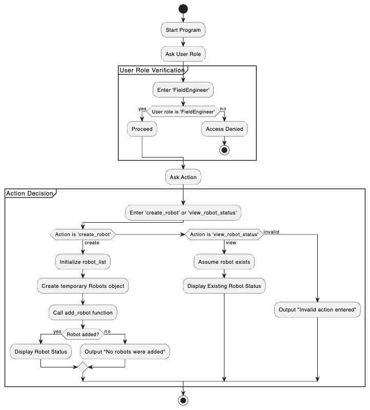
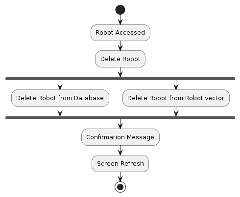

# Activity Diagrams Documentation

## Create Robot and View Robot Status

### Overview

The activity diagram provided outlines the operational workflow of the `test_robot.cpp` function, which serves as the system manager for our robot management system. This documentation aims to explain the diagram's components and their relationships to each other, ensuring a clear understanding of how user inputs dictate the system's behavior.

### Diagram Description

The activity diagram illustrates the sequential steps involved when a field engineer interacts with the robot management system. It details the decision-making process based on user roles and actions, depicting how these inputs lead to different system responses.

#### Key Components

- **Start/End Points**: Indicate the beginning and termination of the process.
- **User Role Verification**: Ensures that only authorized users (Field Engineers) can proceed with actions within the system.
- **Action Decision**: Based on the user’s selection, the system either initiates a robot creation process or displays the status of an existing robot.
- **Feedback Mechanisms**: Provide real-time responses to the user, including confirmation of actions taken or errors encountered.

### Process Flow

1. **Initialization**: The program begins, and the user is prompted to enter their role.
2. **Role Verification**: The user's input is verified. If the role matches "FieldEngineer," the process moves forward. If not, access is denied, and the process ends.
3. **Action Prompt**: Verified users are asked to choose between creating a new robot or viewing the status of an existing one.
4. **Process Execution**:
    - **Create Robot**: If selected, the system initializes a list for robots, creates a temporary robot object, and attempts to add it to the system. Success or failure feedback is provided based on whether the robot is added.
    - **View Robot Status**: If selected, the system assumes the presence of a predefined robot and displays its status.

## Delete Robot

### Description
This diagram shows the flow when a user is deleteing a robot. The user will click on a robot to access its information. After, the user may click the delete button. When the delete button is clicked the robot is deleted from the database and then deleted from the robot vector that is stored in the data_manager. Finally, a confirmation is sent to the user with the id of the robot that has been deleted. The screen is then automatically refreshed.

