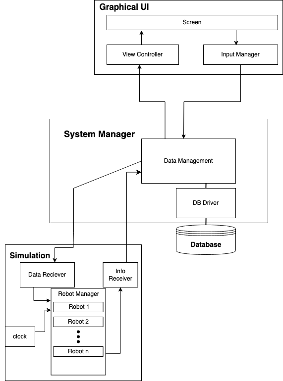
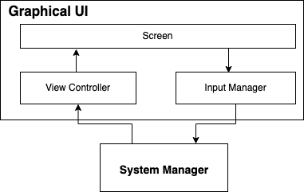
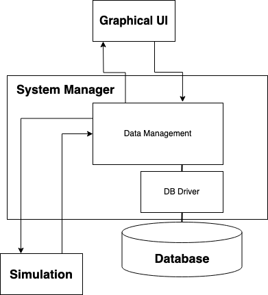
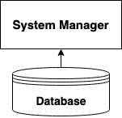
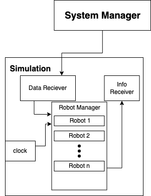

# Architecture
## Full Diagram 

+ This is the full architecture diagram of our system. To understand this fully we will be disecting this diagram by component. Starting with The Graphical User Interface.
## Graphical User Interface Diagram

+ The UI starts with the screen entity. This is what is displayed to the user and what the user directly interact with. The information that is inputted to the screen if then filtered through to the Input Manager. The input manager then reads this data and converts it to be then pushed into the System Manager. When the data is to be pushed back to the UI it will come from the System Manager. This data is passed into the View Controller. This view controller will manage the data recieved and push the relevant data to the user. For example if the system manager was pushing data to the UI about robot one to the building staff, this data from the system manager would include all the data that pertained to robot one. In the view controller this data is then filtered to contain only the data that the building staff would be able to see like robot one's status and properties. While if the senior management was requesting this data it would push the business metrics of robot one.
## System Manager Diagram

+ The System Manager is the communication between the 3 other components. The data that the system manager recieves is then passed into the Data Manager. This data manager will interpret the data and send it to the other components that need to be updated, or are receiveing the data. When data is being passed to the database there is another part of the system manager called the DataBase Driver or DB Driver. The DB driver is what converts the data into Mongo DB to be sent into the database and what converts the data from the database into what can be read by the system manager.
## Database Diagram

+ The Database itself contains all the information about the robots, errors, tasks, rooms, etc. The database recieves data from teh system manager which is added into the database. Also, when queried for, sends its data out to the system manager.
## Simulation Diagram

+ The Simulation recieves the information from the system manager about the tasks and the updates for the robots which is processed in the Data Receiver. The receiver then passes the information to the Robot Manager. The robot manager controls the robots in the simulation and their tasks. The Robot manager is also controlled by the clock. The information from the robot manager is then sent to into the info reciever which processes and sends out the data into the system manager.
