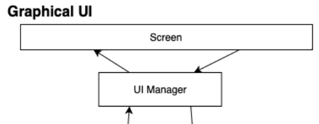
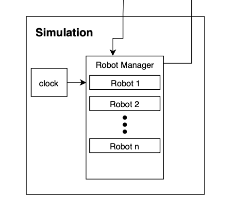

# Architecture
## Full Diagram 

+ This is the full architecture diagram of our system. To understand this fully we will be disecting this diagram by component. Starting with The Graphical User Interface.
## Graphical User Interface Diagram

+ The user's experience with the software begins with the screen. Here is where the user provides all input, such as selecting their user role, viewing robots within their system, and adding tasks for their robots. The UI manager represents a collection of frame classes that are responsible for receiving input from the user, passing that input to the system manager, and receiving updated information from the system manager. We have an event-driven structure which is reliant on user interaction for most data updates, including a refresh button that is used to pull the most current robot, task, and room data.
## System Manager Diagram

+ The System Manager is the communication between the 3 other components. The data that the system manager recieves is then passed into the Data Manager. This data manager will interpret the data and send it to the other components that need to be updated, or are receiveing the data. When data is being passed to the database there is another part of the system manager called the DataBase Driver or DB Driver. The DB driver is what converts the data into Mongo DB to be sent into the database and what converts the data from the database into what can be read by the system manager.
## Database Diagram

+ The Database itself contains all the information about the robots, errors, tasks, rooms, etc. The database receives data from teh system manager which is added into the database. Also, when queried for, sends its data out to the system manager.
## Simulation Diagram

+ The Simulation receives the information from the system manager about the tasks and the updates for the robots which is processed in the Data Receiver. The receiver then passes the information to the Robot Manager. The robot manager controls the robots in the simulation and their tasks. The Robot manager is also controlled by the clock. The information from the robot manager is then sent to the Info Reciever which processes and sends out the data into the system manager.
