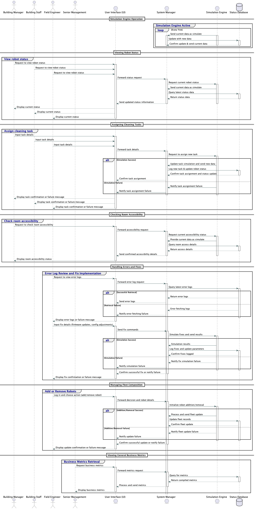

# Sequence Diagram

## Actors and Entities

+ **Building Manager (BM), Building Staff (BS), Field Engineer (FE), Senior Management (SM)**: These are user roles interacting with the system through the User Interface (UI).

+ **User Interface (UI)**: Serves as the primary interface for users to interact with the system, forwarding requests to the System Manager.

+ **System Manager (SMgr)**: Acts as a central controller, managing requests between the UI, Simulation Engine, and Database.

+ **Simulation Engine (SimEng)**: Performs real-time simulations and provides updates based on specific requests or triggered operations.

+ **Status Database (SDB)**: Stores and retrieves data related to the robot fleet, including status updates, task assignments, error logs, and metrics.

## Sequences Described in the Diagram

+ **Simulation Engine Operation**: Continuous operation loop where the Simulation Engine sends simulated data to the System Manager, which then updates the database. This loop runs for each tick of the system's internal clock.

+ **Viewing Robot Status**: Involves the users requesting robot status which triggers queries to the Simulation Engine for the most current simulated data, and subsequent data retrieval from the database.

+ **Assigning Cleaning Tasks**: Users input task details, which are sent to the Simulation Engine for simulation. Depending on the success or failure of the simulation, the task details are either logged into the database or an error message is sent back.

+ **Checking Room Accessibility**: A request for room accessibility triggers a simulation to check current access conditions. Results are fetched from the database and relayed back to the user.

+ **Handling Errors and Fixes**: Starts with an error log request and may involve fixing errors based on the logs retrieved. This process includes simulation of fixes and updates to the database based on the outcomes of these simulations.

+ **Managing Fleet Composition**: Includes adding or removing robots from the fleet, involving simulations to determine the impact and updating the database accordingly.

+ **Viewing General Business Metrics**: Senior Management requests business metrics which are fetched from the database through the System Manager and displayed via the UI.

## Error Handling

Each significant process segment includes error handling where operations may fail:
Queries to the database (e.g., when fetching error logs or room accessibility details).
Simulations (e.g., when simulating task assignments or fixes).

## Continuous Operation
The simulation engine's operation is depicted as continuously active, constantly updating and sending feedback to the System Manager, and System Manager sending it to Database, ensuring the system's data reflects the most current simulated reality.
