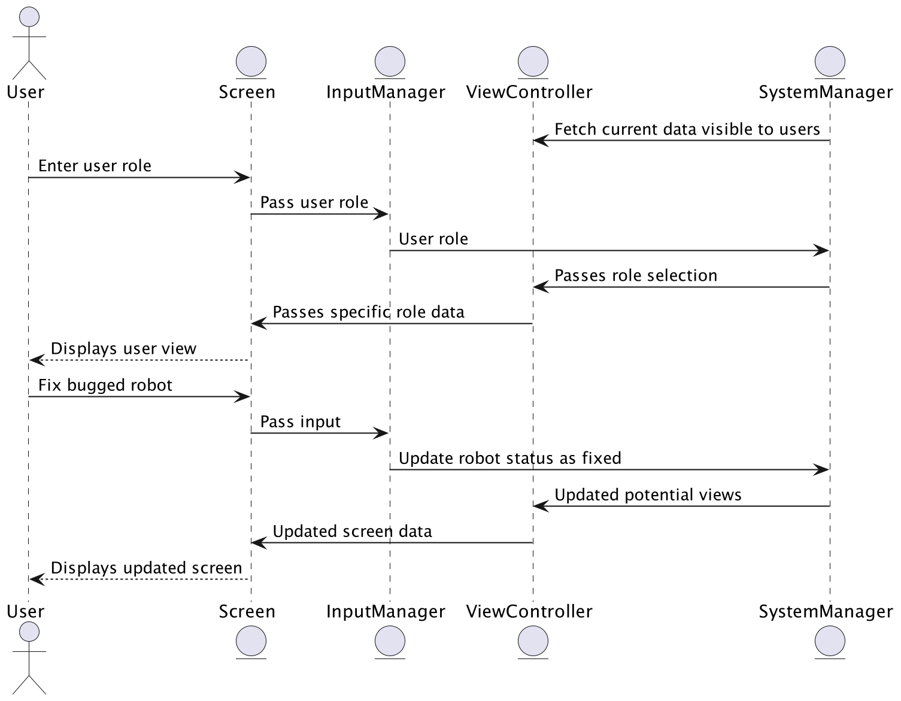

The sequence diagrams that model UI interactions in more detail are split by the actual UI functionality, as opposed to individual users' use cases. Different users will be granted different functionalities, and no single user has access to all of the following functionalities.

Every sequence diagram begins by fetching the current data that is visible to the users. This data flows from the system manager to the view controller (see entity sequence diagrams to see how the system manager gets access to this data). This data flow represents the refreshing of data that would occur when the user refreshes the page or opens the interface for the first time. Every sequence diagram also begins with the user entering their role, which is passed through the input manager to the system manager, where the results of the input can be returned to the view controller, and the user can see only the information that is relevant to their user role. Since these components are constant among the sequence diagrams, they will not be mentioned specifically for each diagram below.

The primary function of the input manager is to take user input in whatever form it is received and relay the input to the system manager. The primary function of the view controller is to filter the data it is receiving from the system manager in order to tailor specific screen views for specific user roles.

# Add and Remove Robots
The user inputs their addition or removal of a robot. This input is passed to the input manager, which then relays the input to the system manager. After this addition or removal, the system manager returns the updated data that is possible to be viewed by users, regardless of role. The view controller then takes this collective data and filters it so that only role-specific data remains for the user.

# Assign Room Status
The user inputs their newly assigned room status. This input is passed to the input manager, which then relays the input to the system manager. After this status update, the system manager returns the updated data that is possible to be viewed by users, regardless of role. The view controller then takes this collective data and filters it so that only role-specific data remains for the user.

# Fix Bugged Robots
The user inputs in order to fix a bugged robot. This input is passed to the input manager, which then relays the input to the system manager. After this robot status update, the system manager returns the updated data that is possible to be viewed by users, regardless of role. The view controller then takes this collective data and filters it so that only role-specific data remains for the user.

# View Business Metrics
The only necessary input to see the business metrics is the user role, which is already covered in the second paragraph at the top.

# View Error Logs
The user selects an individual robot. This input is passed to the input manager, which then relays the input to the system manager. After retrieving the robot-specific data, the system manager returns the updated data that is possible to be viewed by users, regardless of role. The view controller then takes this collective data and filters it so that only role-specific data remains for the user.

# View Robots
The user selects an individual robot. This input is passed to the input manager, which then relays the input to the system manager. After retrieving the robot-specific data, the system manager returns the updated data that is possible to be viewed by users, regardless of role. The view controller then takes this collective data and filters it so that only role-specific data remains for the user.

