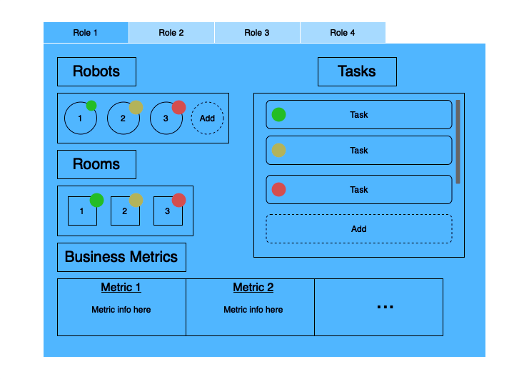
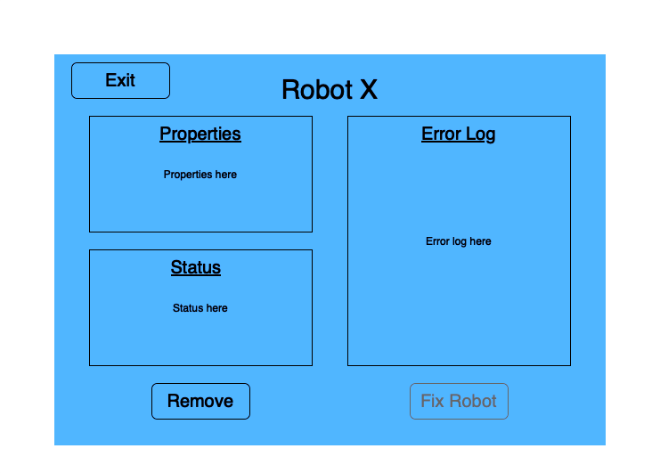
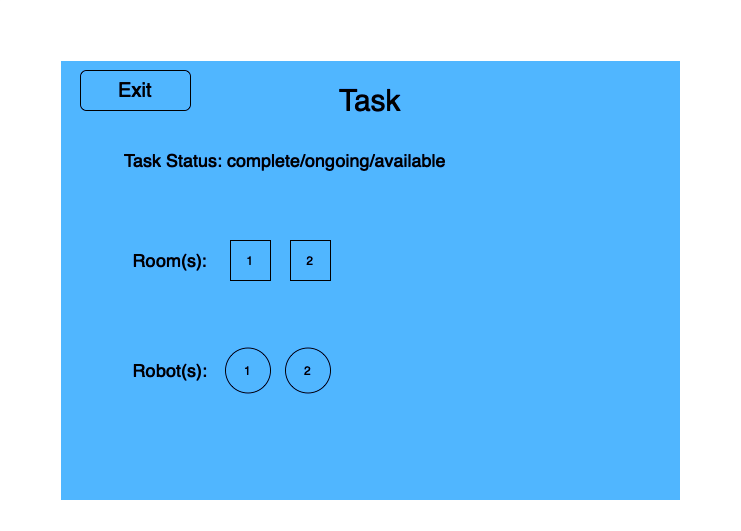
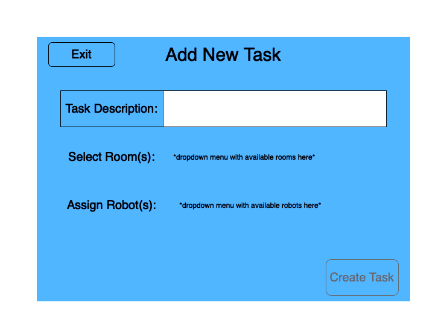
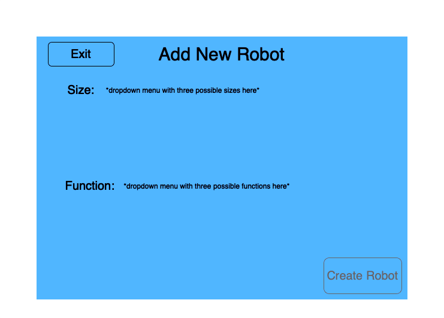

# Main User View

The Main User View shows the screen an individual user would see when they opened up the GUI for the first time. The tabs at the top allow a user to toggle between the different user views. The roles are not specified because the information on the screen shows all the possible information across all four user roles–no single user would see all of this information, this is a sum of all information present to all possible users in this window. For example, only the field engineer would have the option to add robots, so this visual option would only be displayed on the field engineer tab. Robots, rooms, and tasks all have three different possible statuses, which are represented with green, yellow, or red lights. For robots, these statuses are available, busy, and out of order/error. For rooms, these statuses are available, busy (being cleaned), and unavailable. For tasks, these statuses are available, busy (being worked on), and complete. The building manager will be able to directly toggle the statuses of the rooms between available and unavailable. The list of tasks has a scroll bar to maintain a list longer than can fit on the screen. Completed tasks (indicated with red) will be moved to the bottom of this list so the user does not have to filter through them, but can still view the task completion history. Business metrics are viewed directly in this window as opposed to a separate window, because this display is only present for senior management, who does not have the other information on the screen.

Every window besides the main user window has an exit button. Pressing this button will return the user to the main user window.

# Robot Selected View

The robot selected view is the view that is displayed when someone selects a robot from the robots menu in the main user view. Not every user can reach this view (i.e., senior management), nor will this view be the same for every user. For example, only the field engineer will be able to remove or fix robots. The fix robot button is grayed out because it is dependent on the robot being bugged and needing fixing in order to work. Robot properties will include information like robot size and type, and robot status will include information such as remaining battery life and whether the robot is busy. 

# Task Selected View

The task selected view is the view that is displayed when someone selects a task from the tasks menu in the main user view. Not every user can reach this view (i.e., senior management). This window displays the task name, status, and which rooms and robots are involved with the task. 

# Add Task View

The add task view is the view that is displayed when someone adds a task from the tasks menu in the main user view. Not every user can reach this view (i.e., senior management). This window allows users to add tasks to the task menu. They must specify the task name (in a text box with a character limit), and then select the rooms and robots involved with the task from a dropdown menu. This dropdown menu will only display rooms and robots that are available, so that the user cannot assign busy robots or unavailable rooms. The button to add a task is grayed out until the user satisfies all necessary specifications (name, rooms, and robots).

# Add Robot View

The add robot view is the view that is displayed when the field engineer clicks the add robot button in the main user view. Only the field engineer can reach this view. Dropdown menus allow the user to specify robot size and type. Once these menus are used to make the necessary specifications, the grayed create robot button will become available.

