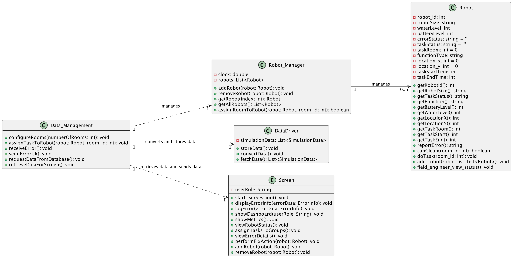
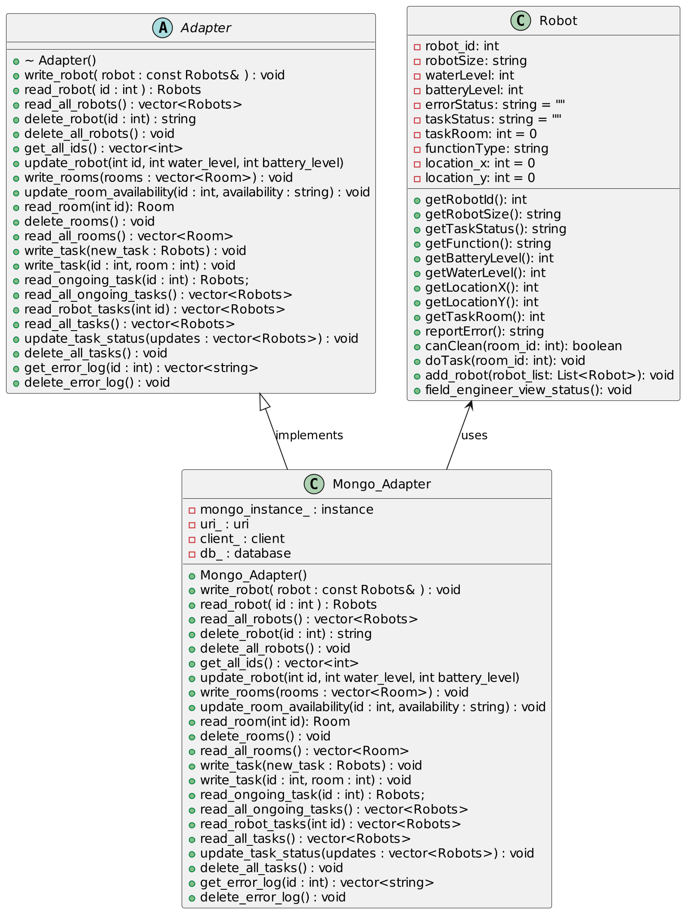

# Class Diagram

## Entities

### 1. **Robot**
The `Robot` class represents a robot in the system. Each robot has several attributes related to its operational state (e.g., battery level, water level) and the tasks it performs. It can report errors and is assigned to clean rooms based on its functions.

#### Attributes:
- `robot_id: int` — Unique identifier for the robot.
- `robotSize: string` — Size of the robot (e.g., Large, Medium, Small).
- `waterLevel: int` — Current water level of the robot.
- `batteryLevel: int` — Current battery level of the robot.
- `errorStatus: string` — Represents the error state of the robot (if any).
- `taskStatus: string` — Current task status of the robot.
- `taskRoom: int` — The ID of the room the robot is tasked with cleaning.
- `functionType: string` — The function the robot can perform (e.g., Scrub, Vacuum, Shampoo).
- `location: int` — Current location of the robot.
- `taskStartTime: int` — The start time of the robot's current task.
- `taskEndTime: int` — The end time of the robot's current task.

#### Methods:
- `getRobotId(): int` — Returns the robot's ID.
- `getRobotSize(): string` — Returns the robot's size.
- `getTaskStatus(): string` — Returns the current task status of the robot.
- `getFunction(): string` — Returns the function the robot can perform.
- `getBatteryLevel(): int` — Returns the battery level of the robot.
- `getWaterLevel(): int` — Returns the water level of the robot.
- `getLocation(): int` — Returns the current location of the robot.
- `getTaskRoom(): int` — Returns the room the robot is tasked with cleaning.
- `getTaskStart(): int` — Returns the task start time.
- `getTaskEnd(): int` — Returns the task end time.
- `reportError(): string` — Reports the current error status of the robot.
- `canClean(room_id: int): boolean` — Determines if the robot can clean a room based on the room ID and its capabilities.
- `+doTask(room_id: int): void` - Robot actually do task in the given room.
- `+field_engineer_view_status(): void` - Viewing robot status from the field engineer perspective.

### 2. **Robot_Manager**
The `Robot_Manager` class is responsible for managing a collection of robots and assigning them tasks. It keeps track of all robots in the system and assigns them to clean specific rooms based on their capabilities. It can also adds or removes robot

#### Attributes:
- `clock: double` — A system clock to track robot task timing.
- `robots: List<Robot>` — A list that holds all the robots managed by the system.

#### Methods:
- `addRobot(robot: Robot): void` — Adds a robot to the system.
- `removeRobot(robot: Robot): void` — Removes a robot from the system.
- `getRobot(index: int): Robot` — Retrieves a robot from the system by index.
- `getAllRobots(): List<Robot>` — Retrieves all robots managed by the system.
- `assignRoomToRobot(robot: Robot, room_id: int): boolean` — Assigns a robot to clean a room (represented by `room_id`).

### 3. **Data_Management**
The `Data_Management` class acts as the central bridge for data handling and communication between all other classes in the system. It manages the flow of data from the simulation, converting and storing it via the `DataDriver` class to the Database, and retrieving it for display or assignment purposes.

#### Methods:
- `configureRooms(numberOfRooms: int): void` — Configures the rooms in the simulation by storing room data in the database.
- `assignTaskToRobot(robot: Robot, room_id: int): void` — Assigns a task to a robot based on room ID.
- `receiveError(): void` — Receives error data from the robots.
- `sendErrorUI(): void` — Sends error data to the user interface (`Screen`).
- `requestDataFromDatabase(): void` — Requests data from the database (through `DataDriver`).
- `retrieveDataForScreen(): void` — Retrieves converted data for display on the `Screen`.

### 4. **DataDriver**
The `DataDriver` class is responsible for converting and storing data into database, also fetches the data as required by the `Data_Management` class.

#### Attributes:
- `simulationData: List<SimulationData>` — A list holding the raw data from the simulation.

#### Methods:
- `storeData(): void` — Stores simulation data into the database.
- `convertData(): void` — Converts raw simulation data into a usable format.
- `fetchData(): List<SimulationData>` — Fetches data from the database when requested.

### 5. **Screen**
The `Screen` class represents the user interface. Based on the role of the user, it displays the necessary information, such as robot status or metrics, and allows interaction with the system.

#### Attributes:
- `userRole: String` — Stores the role of the current user (e.g., SeniorManagement, BuildingManager, etc.).

#### Methods:
- `startUserSession(): void` — Starts a session for the user.
- `displayErrorInfo(errorData: ErrorInfo): void` — Displays error information on the screen.
- `logError(errorData: ErrorInfo): void` — Logs error data for later review.
- `showDashboard(userRole: String): void` — Displays the dashboard based on the user role.
- `showMetrics(): void` — Shows robot utilization and error metrics (for Senior Management).
- `viewRobotStatus(): void` — Displays the status of robots.
- `assignTasksToGroups(): void` — Allows assignment of tasks to robot groups (for Building Manager).
- `viewErrorDetails(): void` — Displays detailed error information (for Field Engineer).
- `performFixAction(robot: Robot): void` — Allows performing fix actions on robots (for Field Engineer).
- `addRobot(robot: Robot): void` — Adds a new robot to the system (for Field Engineer).
- `removeRobot(robot: Robot): void` — Removes a robot from the system (for Field Engineer).

## Relationships

### 1. **Robot_Manager ↔ Robot**
The `Robot_Manager` manages a collection of robots. It stores a list of `Robot` instances and can add or remove robots from the system. It also assigns tasks to robots by linking them with specific room IDs.

### 2. **Data_Management ↔ Robot_Manager**
`Data_Management` interacts with `Robot_Manager` to assign tasks and manage robot operations. It serves as the intermediary between `Robot_Manager` and other parts of the system.

### 3. **Data_Management ↔ DataDriver**
`Data_Management` relies on `DataDriver` for data storage and retrieval. When new data arrives from the simulation, `Data_Management` sends it to `DataDriver` for conversion and storage in the database. When data is needed (e.g., for display on the `Screen`), `Data_Management` requests it from `DataDriver`.

### 4. **Data_Management ↔ Screen**
`Data_Management` retrieves data for the user interface (`Screen`) to display relevant information. This includes error data, robot statuses, and task assignments. The `Screen` never directly communicates with other parts of the system; it relies entirely on `Data_Management` to retrieve the necessary data.

### 1. **Mongo Adapter**

The `Mongo Adapter` is the class that allows MongoDB to be called and utilized in the project easily.

The `Mongo Adapter` implements `Adapter`. These functions allow another class to simply access the data and update, read, or write information. 
#### Attributes
The attributes for the MongoAdapter create an instance of the mongodb database that we can then connect to and use.
- `mongo_instance_ : instance` 
- `uri_ : uri`
- `client_ : client` 
- `db_ : database` 

#### Methods
+ `Mongo_Adapter()` - MongoAdapter Constructor
+ `write_robot( robot : const Robots& ) : void ` - Writes a robot to the database
+ `read_robot( id : int ) : Robots` - Reads a robot frm the database and returns it as a robot object
+ `read_all_robots() : vector<Robots>` - Reads all thr robots from the database and returns it as a vector of robots
+ `delete_robot(id : int) : string` - Deletes thr specified robot from the table
+ `delete_all_robots() : void` - Deleted the entire collection of robots
+ `get_all_ids() : vector<int>` - Reads all ids that have been given to robots and returns them as a vector of integers
+ `update_robot(int id, int water_level, int battery_level)` - Updates the Water and Battery level of a specified robot in the database
+ `write_rooms(rooms : vector<Room>) : void` - Creates a rooms table and writes all the robots in the vector into the tables
+ `update_room_availability(id : int, availability : string) : void` - Change a rooms availability to the parameter specified
+ `read_room(int id): Room` - Returns a room object of a specific room from in the database
+ `delete_rooms() : void` - Delete all rooms from the Database
+ `read_all_rooms() : vector<Room>` - Read all rooms from the database and return as a vector of rooms
+ `write_task(new_task : Robots) : void` - Write task to data base using robot object for the information
+ `write_task(id : int, room : int) : void` - Write task to database with a robot id and a room number
+ `read_ongoing_task(id : int) : Robots;` - Read an obgoing task from a specific robot
+ `read_all_ongoing_tasks() : vector<Robots>` - Read all ongoing tasks of all the robots
+ `read_robot_tasks(int id) : vector<Robots>` - Read all the tasks a robot has done and are ongoing
+ `read_all_tasks() : vector<Robots>` - Read all tasks from the task table
+ `update_task_status(updates : vector<Robots>) : void` - Update the tasks and robots from the robots we got from the simulation and data manager
+ `delete_all_tasks() : void` - Delete all tasks from the task table
+ `get_error_log(id : int) : vector<string>` - Return the error log for a specific robot
+ `delete_error_log() : void ` - Delete the error log

