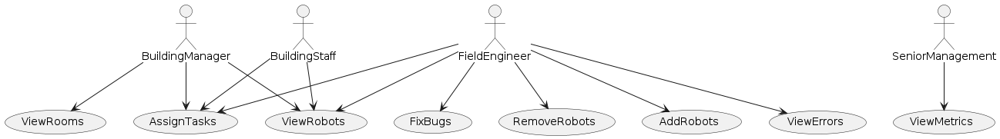

# Use Cases

+ This use case diagram captures these user stories
    + For the Building Staff:
        + As a building staff, I want to view robot status and properties.
        + As a building staff, I want to assign cleaning tasks to robots.
    + For the Building Manager:
        + As a building manager, I want to view robot fleet status and properties.
        + As a building manager, I want to assign cleaning tasks to a fleet of robots.
        + As a building manager, I want to be able to determine if rooms are accessible or not
    + For the Field Engineer.
        + As a field engineer, I want to view robot status and properties.
        + As a field engineer, I want to assign cleaning tasks to robots.
        + As a field engineer, I want to be able to fix bugged robots.
        + As a field engineer, I want to be able to add robots from the system.
        + As a field engineer, I want to be able to remove robots from the system.
        + As a field engineer, I want to be able to view detailed error logs.
    + For Senior Management
        + As senior management, I want to view general metrics about robot efficiency, utilization, and error rates.
        
Note that viewing a fleet of robots and viewing the robots are encapsulated in the same ViewRobots.  
Note that assigning a task to a fleet of robots and assigning a task to one robots are encapsulated in the same View Robots.
