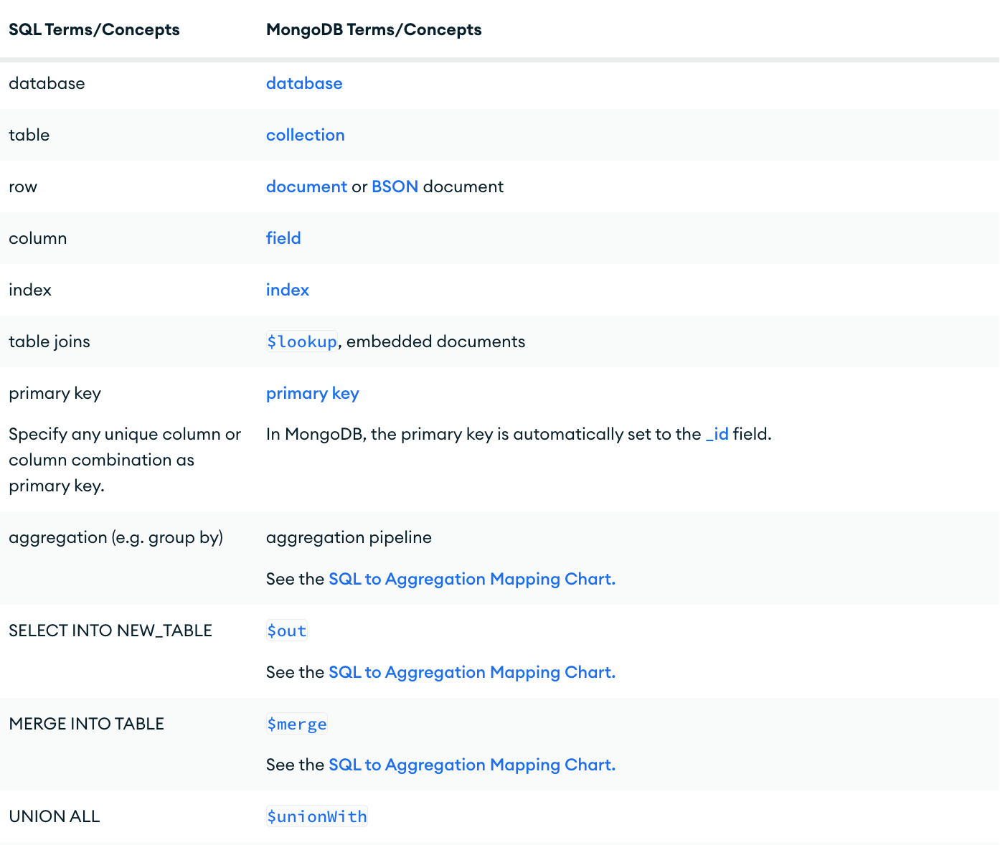

# What is MongoDB
MongoDB is a document database used to build highly available and scalable internet applications. Instead of storing data in tables of rows or columns like SQL databases, each record in a MongoDB database is a document described in BSON, a binary representation of the data. This is a common choice since you do not need to normalize data. The records(similar to rows in SQL) are stored as documents in compressed BSON files. The documents can be retrieved directly in JSON format, which has many benefits:
+ It is a natural form to store data.
+ It is human-readable.
+ Structured and unstructured information can be stored in the same document.
+ You can nest JSON to store complex data objects.
+ JSON has a flexible and dynamic schema, so adding fields or leaving a field out is not a problem.
+ Documents map to objects in most popular programming languages.
## SQL to MongoDB
MongoDB database stores its data in collections. A collection holds one or more BSON documents. Documents are analogous to records or rows in a relational database table. Each document has one or more fields; fields are similar to the columns in a relational database table.

